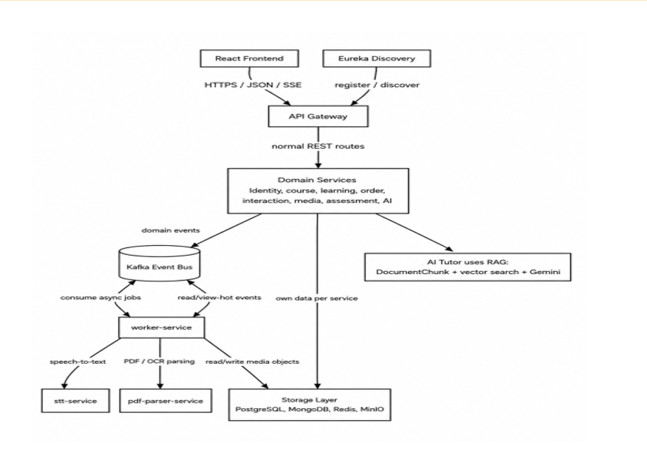
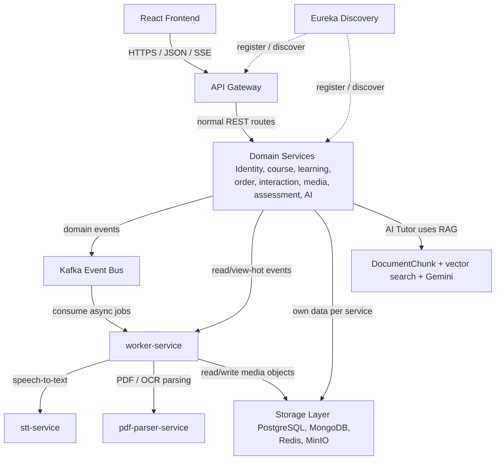

# 🎓 E-Learning Platform - Kiến Trúc Microservices & Trợ Lý Học Tập AI (Hybrid RAG)

[](https://www.oracle.com/java/)
[](https://spring.io/projects/spring-boot)
[](https://react.dev/)
[](https://www.docker.com/)
[](LICENSE)

Nền tảng học trực tuyến thế hệ mới được phát triển trên kiến trúc **Microservices** phân tán, tích hợp công nghệ **Trợ lý học tập AI thông minh (Hybrid RAG)**, tự động hóa xử lý học liệu truyền thông (**HLS Video Transcoding & AES-128 Encryption**), nhận dạng giọng nói tự động (**Whisper ASR**) và cổng thanh toán tự động (**VNPay**).

---

## 📌 1. Dự Án Này Giải Quyết Bài Toán Gì?

Hệ thống được thiết kế nhằm giải quyết triệt để 4 nhóm bài toán cốt lõi của các nền tảng E-learning quy mô lớn hiện nay:

### 🚀 Bài toán hiệu năng & Khả năng chịu tải (Scalability)
*   **Thách thức:** Các tác vụ xem video bài giảng (Streaming), làm bài tập trực tuyến tập trung đông học viên và xử lý AI thường gây quá tải hệ thống nguyên khối (Monolith).
*   **Giải pháp:** Phân rã hệ thống thành các **Domain Services độc lập**. Dịch vụ xử lý video (`worker-service`), chấm điểm (`assessment-service`) và AI (`ai-service`) được tách riêng biệt để dễ dàng phân bổ tài nguyên và tự động co giãn (Auto-scaling) theo lưu lượng truy cập thực tế.

### 🛡️ Bài toán Bảo mật & An toàn thông tin (BFF & Zero Trust)
*   **Thách thức:** Lỗ hổng tấn công XSS dễ dàng đánh cắp Access Token (JWT) được lưu ở `localStorage` của trình duyệt. Bên cạnh đó, mạng nội bộ dễ bị tấn công di chuyển ngang nếu chỉ tin tưởng vào tường biên Gateway.
*   **Giải pháp:**
    *   Triển khai mô hình **BFF (Backend For Frontend)**: Token JWT được đóng gói trong **HttpOnly & Secure Cookie**, ẩn hoàn toàn khỏi mã nguồn Javascript chạy trên trình duyệt. API Gateway ([BffCookieFilter](file:///d:/DO_AN_TOT_NGHIEP/DEPLOY/e-learning-platform/api-gateway/src/main/java/com/hust/apigateway/filter/BffCookieFilter.java)) sẽ tự động bóc tách Cookie để đính kèm vào Header `Authorization: Bearer` trước khi gửi vào mạng nội bộ.
    *   Tích hợp hệ thống quản lý định danh tập trung **Keycloak SSO** bảo mật chuẩn doanh nghiệp.
    *   Áp dụng nguyên lý **Zero Trust**: Từng service tự giải mã chữ ký JWT và phân quyền ở mức phương thức (Method-level authorization).

### 🤖 Bài toán chính xác ngữ cảnh của Trợ lý ảo AI (Hybrid RAG & Rerank)
*   **Thách thức:** RAG thông thường (chỉ dùng Vector Search) thường cho kết quả sai lệch khi truy vấn các thuật ngữ viết tắt, mã lỗi, hoặc từ khóa chính xác.
*   **Giải pháp:** 
    *   **Parallel Hybrid Search:** Chạy song song tìm kiếm ngữ nghĩa (Cosine Similarity trên **PostgreSQL pgvector**) và tìm kiếm từ khóa (**Elasticsearch BM25**).
    *   **RRF (Reciprocal Rank Fusion):** Trộn kết quả tìm kiếm theo thứ hạng kháng nhiễu.
    *   **Cohere Rerank:** Xếp hạng lại chuyên sâu bằng mô hình Cross-Encoder (`rerank-multilingual-v3.0`) để chọn ra Top 3 đoạn ngữ cảnh liên quan nhất trước khi nạp vào **Gemini LLM**.
    *   **Sliding Window:** Tự động gộp phân đoạn lân cận để tránh đứt gãy câu chữ ở biên phân đoạn.

### ⚙️ Tự động hóa vận hành & Nội dung số
*   **HLS Video Transcoding:** `worker-service` tự động chuyển đổi video bài giảng thô sang định dạng **HLS (.m3u8 & .ts)** bằng **FFmpeg**, đồng thời mã hóa bảo mật từng phân đoạn bằng thuật toán **AES-128** chống tải lậu video.
*   **Whisper Speech-to-Text (STT):** Dịch vụ Whisper AI chạy ngầm chuyển âm thanh video thành phụ đề bài giảng (`.vtt`) tự động.
*   **Trích xuất học liệu tự động (PDF Parser):** Dịch vụ `pdf-parser-service` (sử dụng Python/OCR) tự động phân tách và trích xuất nội dung văn bản từ tài liệu slide/PDF học tập tải lên để nạp vào cơ sở dữ liệu tri thức phục vụ cho Trợ lý ảo AI.
*   **VNPay Integration:** Tự động hóa hóa đơn và kích hoạt quyền học tức thời ngay sau khi giao dịch thành công.

---

## 📐 2. Sơ Đồ Kiến Trúc Hệ Thống (Architecture Diagram)

Hệ thống được thiết kế theo đúng mô hình kiến trúc phân lập của sơ đồ nghiệp vụ và hạ tầng phân tán sau:



*(Lưu ý: Nếu hình ảnh không hiển thị, bạn có thể tham khảo sơ đồ vẽ trực tiếp bằng code Mermaid dưới đây)*



---

## 🛠️ 3. Các Bước Deploy Hệ Thống

### 📋 Yêu cầu hệ thống tối thiểu
*   **Docker** (v20.10.x trở lên) và **Docker Compose** (v2.x trở lên).
*   **RAM tối thiểu:** 8GB (Khuyến nghị: 16GB để chạy mượt mà toàn bộ container hạ tầng và microservices).
*   **CPU:** 4 Cores trở lên.

### 🌐 3.1. Cấu hình DNS / File hosts cục bộ
Để cơ chế xác thực Single Sign-On (Keycloak) và Cookie bảo mật hoạt động chính xác giữa các subdomains, bạn cần thêm các dòng sau vào file `hosts` của hệ điều hành (Đường dẫn Windows: `C:\Windows\System32\drivers\etc\hosts`):

```text
127.0.0.1 app.hust-elearning.online
127.0.0.1 api.hust-elearning.online
127.0.0.1 auth.hust-elearning.online
127.0.0.1 storage.hust-elearning.online
```

### ⚙️ 3.2. Cấu hình biến môi trường
Tạo file `.env` tại thư mục gốc của dự án bằng cách copy từ file mẫu:
```bash
cp .env.example .env
```
Cấu hình các biến key quan trọng trong file `.env`:
*   `GEMINI_API_KEY`: Key dịch vụ AI từ Google AI Studio.
*   `COHERE_API_KEY`: Key dịch vụ Cohere Rerank.
*   `TAVILY_API_KEY`: Key dịch vụ Tavily Web Search.
*   `VPS_HOST`: Địa chỉ IP VPS hoặc cấu hình `127.0.0.1` nếu chạy local.

### 🐳 3.3. Khởi chạy tầng hạ tầng (Infrastructure)
Khởi chạy các cơ sở dữ liệu và hệ thống Message Broker trước để đảm bảo trạng thái sẵn sàng cho microservices:
```bash
docker compose -f docker-compose-prod.yml up -d postgres-db mongo-db redis kafka keycloak minio elasticsearch
```

### 🔑 3.4. Cấu hình Keycloak Realm & Client
1.  Truy cập trang quản trị Keycloak: `https://auth.hust-elearning.online` (tài khoản mặc định: `admin` / `admin`).
2.  Tạo mới hoặc Import Realm cấu hình sẵn từ tệp tin [realm-export.json](file:///d:/DO_AN_TOT_NGHIEP/DEPLOY/e-learning-platform/docker_dev/realm-export.json).
3.  Đảm bảo các Client `api-gateway` và `e-learning-fe` đã được kích hoạt đúng cấu hình Redirect URIs (`https://app.hust-elearning.online/*`).

### 📦 3.5. Biên dịch và khởi chạy toàn bộ Hệ thống
Chạy lệnh Maven tại thư mục gốc để đóng gói các file JAR cho microservices Java:
```bash
mvn clean package -DskipTests
```
Khởi chạy toàn bộ hệ thống microservices cùng giao diện frontend:
```bash
docker compose -f docker-compose-prod.yml up -d --build
```

### 🔍 3.6. Kiểm tra các dịch vụ
Sau khi khởi động xong (khoảng 1-2 phút), bạn có thể kiểm tra trạng thái hoạt động của hệ thống tại các địa chỉ:
*   **Trang ứng dụng chính (React Frontend):** `https://app.hust-elearning.online`
*   **Trang quản lý dịch vụ (Eureka Dashboard):** `http://localhost:8761`
*   **MinIO Console (Quản lý File):** `http://localhost:9001` (tài khoản: `minioadmin` / `minioadmin`)

---

## 📈 4. Quản Lý Tính Năng Nổi Bật Trong Mã Nguồn

*   **Tải lên đề thi hàng loạt từ file Excel/CSV:** Cấu trúc đọc và phân tích dữ liệu dạng index động nằm trong [QuizServiceImpl.java:L350](file:///d:/DO_AN_TOT_NGHIEP/DEPLOY/e-learning-platform/assessment-service/src/main/java/com/hust/assessmentservice/service/impl/QuizServiceImpl.java#L350).
*   **Bộ lọc bảo mật Cookie BFF:** Thực thi bóc tách cookie tại [BffCookieFilter.java](file:///d:/DO_AN_TOT_NGHIEP/DEPLOY/e-learning-platform/api-gateway/src/main/java/com/hust/apigateway/filter/BffCookieFilter.java).
*   **Giới hạn tần suất API (Rate Limiting Aspect):** Chặn spam và brute-force bằng Redis Lua Script tại [RateLimitAspect.java](file:///d:/DO_AN_TOT_NGHIEP/DEPLOY/e-learning-platform/common-library/src/main/java/com/hust/commonlibrary/aspect/RateLimitAspect.java).
*   **Xử lý video HLS & Trích xuất âm thanh:** Triển khai chạy FFmpeg nén tại [VideoProcessingService.java](file:///d:/DO_AN_TOT_NGHIEP/DEPLOY/e-learning-platform/worker-service/src/main/java/com/hust/workerservice/service/VideoProcessingService.java).
*   **Tìm kiếm lai nâng cao & Reranker:** Cấu hình Cohere & RRF tối ưu ngữ cảnh AI tại [RagServiceImpl.java](file:///d:/DO_AN_TOT_NGHIEP/DEPLOY/e-learning-platform/ai-service/src/main/java/com/hust/aiservice/service/impl/RagServiceImpl.java).
